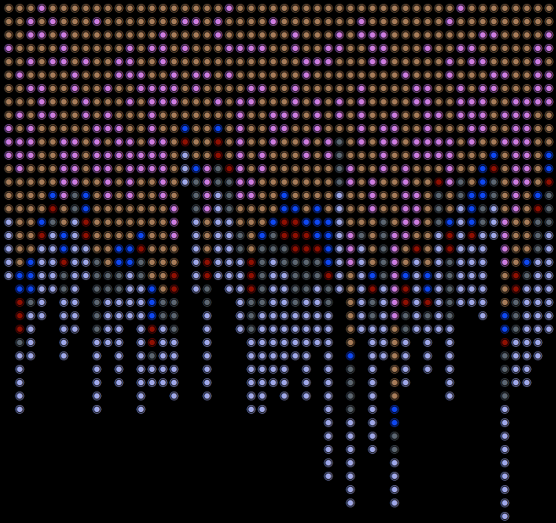

# 4gemint

Play connect-four on the blockchain.

## Setup

    bundle install
    bin/check

## Run

Run the project like this

    bin/run
  
and get this wonderful game state thrown at your terminal

## Copyright

Held by Renuo, released under the MIT license
